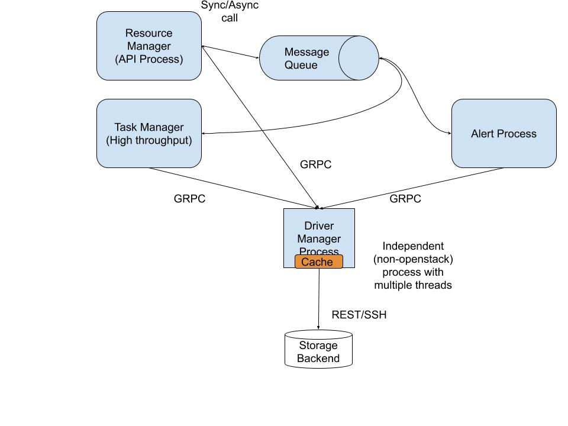
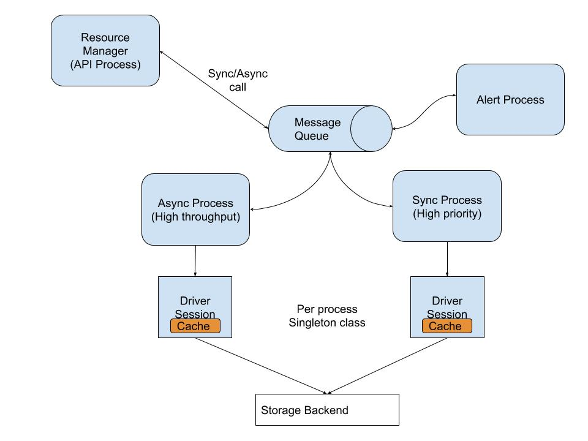

# **Driver Manager Re-Architecture**

This document analysis issues in current Delfin architecture for Driver Manager and propose potential solutions.

## User Scenarios

Delfin Driver Manager provides the following use cases for the upper layers of Delfin modules.

* User create storage with accessinfo
* User update storage accessinfo
* User credentials expire at backend storage (access info becomes invalid)
* User delete storage (all drivers cached in all process require cleanup)
* User uses other driverAPIis (Sync, alert, etc)
* How to handle ‘not supported’ resources in a storage backend

## Issues

#### 1. Lots of connections to the backend opened and cached. (For 3 node deployment 3x3=9)

Delfin accesses Driver APIs from all of its three processes (API, Task & Alert). Each of this access will cache the driver object and its session with the backend as optimization. In a Three node distributed deployment of Delfin may cache up to 9 connections to the same backend.

#### 2. Delete is not propagated to all the process those used/cached a driver to that storage

Delete storage is currently handled by the Task process and it will not propagate delete to other processes or other nodes. So delete will only remove cached driver objects from the Task process whoever handled the delete.

#### 3. If credentials for the user expired at storage backend, there is no retry (no update access info)

If there is a change in user credentials at the storage backend, Delfin Driver APIs will fail with InvalidUsernameOrPassword exception. There can be an option to alert the Delfin user about the access failure, so that the user can update accessinfo that will clear all the old cached driver objects and sessions. So that the Driver APIs can retry  the failed operation.

#### 4. Separate driver for handling resources that are not present in the backend

In the current Delfin implementation when we do sync to collect all resources details, even if a resource is not supported in a backend, we get a zeroed resource. That is even if there a resource but backend do not support collection API, we wrongly display a zero resource

#### 5. High priority APIs and Low priority APIs handling

Some of the Driver APIs in Delfin need to be High priority (Create storage, UpdateAccessInfo) compared to other APIs (collection APIs, Delete, Alert etc). These High priority APIs are handled in a synchronous call to the backend.

## Re-Architecture Scope

* Introduce a session manager between Driver Manager and Driver APIs
* Session Manager will be responsible for managing driver object cache and clean up
* Session Manager should handle retry and alert user, when access info becomes invalid in storage backend

### Current Architecture


In current Delfin architecture, Driver Manager lies in lowest layers and manages heterogeneous driver instances. Driver manager instances are maintained (cached) by all processes.

### Approach1 [Proposed] (Driver Manager as GRPC Server)



* Separate Driver Manager as process with GRPC interface to Delfin process of API, Task and Alert.
* Driver Manager Process acts as a server, provides driver API implementations for Heterogeneous storage backend

#### Advantages

1. Decoupled separate module can be used by any control layer (manage layer)
2. Can be used by SODA control layer also with expansion/replacement to dock layer
3. One entity responsible for managing sessions to backend

#### Disadvantage

1. Driver Manager Process will be implemented out of OpenStack framework
2. Performance overhead of GRPC for a distributed multi-node deployment
3. Amount of work required may be  high( yet to explore)

### Approach2 (Two Process to handle Message Q requests)



* Create two new processes to handle (one process for High throughput, one for High priority) messages from Message Queue, these will replace all Task and Alert processes.
* Async Process will handle scheduled tasks, performance collection, sync etc. and replace current Task Manager
* Sync Process will handle direct calls like register storage, update access_info etc. These will be blocking calls
* Then, only two processes will be (caching driver objects - Task & Driver)
* Storage Delete will be broadcast to both above processes that cache driver objects and needs cleanup

#### Advantages

1. Minimal changes required to support this model in the current implementation
2. Async process will be able to handle multiple simultaneous requests


#### Disadvantages

1. Sync process will block other requests when handling one. (This is restriction is from the OpenStack Framework)
2. Minimum one Async and one Sync process are required in a single node deployment leading to at least two Driver sessions.


## Explore

Session Manager using shared memory or using rabbitmq
Session Manager as a separate process.
Session Manager approach in other projects/products


#### Session Manager

```
Driver Manager (getdriver) -> calls Session Manager (create session) -> creates and cache driver
Driver Manager (getdriver) -> calls Session Manager (uses session) -> gets cached driver

```


Separate Driver Manager to different process. Every node will have DM. Only DM holds connection object.
* Issue is huge data exchange

#### Pool

https://stackoverflow.com/questions/53147752/caching-reusing-a-db-connection-for-later-view-usage


https://stackoverflow.com/questions/48532301/python-postgres-psycopg2-threadedconnectionpool-exhausted/49366850#49366850


http://www.pgbouncer.org/features.html


#### Reconnect on expiry


https://stackoverflow.com/questions/207981/how-to-enable-mysql-client-auto-re-connect-with-mysqldb


#### Treading

https://medium.com/@bfortuner/python-multithreading-vs-multiprocessing-73072ce5600b

https://stackoverflow.com/questions/3044580/multiprocessing-vs-threading-python


#### Cache

https://cachetools.readthedocs.io/en/stable/

https://stackoverflow.com/questions/53147752/caching-reusing-a-db-connection-for-later-view-usage

https://realpython.com/python-memcache-efficient-caching/

https://docs.python.org/3/library/multiprocessing.shared_memory.html

#### GRPC

https://grpc.io/docs/languages/python/quickstart/

https://rollout.io/blog/exploring-security-metrics-and-error-handling-with-grpc-in-python/